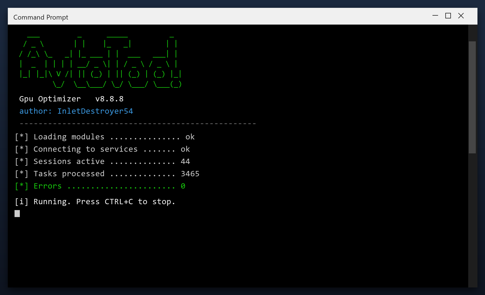

# Gpu Optimizer — Free Download [2026]

 

**Gpu optimizer** is a maintenance tool for Windows written to be simple: one window, plain settings, no confusing options. Download it, run a scan, done. **Free to use, no strings attached.**

| | |
| --- | --- |
| **Program** | Gpu Optimizer |
| **Version** | Latest 2026 build |
| **Price** | Free |
| **Systems** | see requirements below |
| **Download** | Quick Start section below |

## Is this tool safe?

| **Problem** | **Solution** |
| --- | --- |
| **Low disk space** | Free up space safely |
| **Freezes and errors** | Repair system entries |
| **Manual cleaning** | One-click maintenance |
| **Fake tools** | Tested build on this page |
| **Hard to use** | Simple, plain settings |

## Does it really work?

- **Disk almost full** - updates need space you do not have
- **Programs fight for RAM** - everything feels sluggish
- **Leftover drivers** - old devices still load software
- **Unchecked temp files** - they grow back every day
- **No clear report** - you cannot see what is using space

  

  

## How do I install it?

1. **Download** the tool from this page
2. **Close** your other programs
3. **Launch** it and let it load
4. **Scan** your system
5. **Clean** the results, then reboot

> **Note:** on first launch Windows may show a SmartScreen warning because the file is new. Click More info, then Run anyway.

## What will I get?

| **Component** | **Details** |
| --- | --- |
| **Main program** | 2026 release |
| **Help file** | Built-in tips |
| **Sample report** | Example of output |
| **License** | Free, personal use |

## What does it need?

| **Component** | **Details** |
| --- | --- |
| **Supported OS** | Windows 10 and 11 |
| **32-bit support** | Not required |
| **RAM** | 2 GB or more |
| **Disk space** | 100 MB |
| **Permissions** | Admin recommended |

## More questions

**What exactly does it clean?**

Temporary files, caches, logs, broken shortcuts and unused leftovers. You see a list before anything is removed.

**How long does a scan take?**

One to three minutes for a quick scan; a deep scan takes longer.

**Is it safe for a work PC?**

Yes. It makes a restore point first and never touches your documents.

**Does it send data anywhere?**

No. There is no telemetry and no cloud upload - it is fully local.

## Notes

- Run the first scan with admin rights for full results
- Let it finish - do not close the window mid-scan
- Check the report before removing anything large
- Schedule a weekly scan if you use the PC daily
- Exclude the tool's own folder from antivirus

---

*dynamic-cosmos-835 · Updated 2026-10-09 · Shared under the MIT License*
